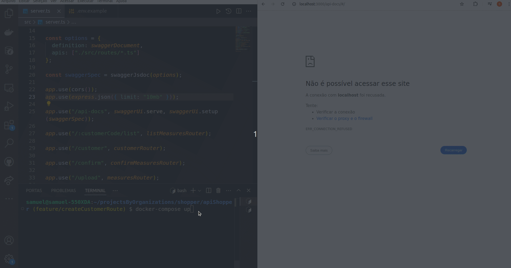
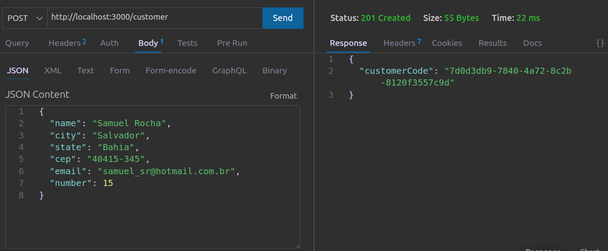

#  Water and Gas Measurement API 

## 🌐 [](https://github.com/SamuelRocha91/apiMeasureWaterAndGas/blob/main/README.md) [](https://github.com/SamuelRocha91/apiMeasureWaterAndGas/blob/main/README_es.md) [](https://github.com/SamuelRocha91/apiMeasureWaterAndGas/blob/main/README_en.md) [](https://github.com/SamuelRocha91/apiMeasureWaterAndGas/blob/main/README_ru.md) [](https://github.com/SamuelRocha91/apiMeasureWaterAndGas/blob/main/README_ch.md) [](https://github.com/SamuelRocha91/apiMeasureWaterAndGas/blob/main/README_ar.md)

This is an API developed to manage measurements for customers across different service types. The application uses Node.js, TypeScript, Prisma, Express.js, and other technologies to provide a robust and scalable backend.


  
  
  

<details>
  <summary><h2>📏 FrontEnd</h2></summary>
  
  - 📏 [React Precision Application](https://github.com/SamuelRocha91/precisionReactApplicationrAndGas/blob/main/README_en.md) - Interface for registering gas and water measurements


</details>

<details>
  <summary><h2>🛠️ Technologies Used</h2></summary>

  - **Node.js**: Runtime environment for JavaScript on the backend.
  - **TypeScript**: Superset of JavaScript that adds static typing to the code.
  - **Express.js**: Minimalist web framework for Node.js.
  - **Prisma**: ORM that simplifies database access.
  - **MySQL**: Database used during development.
  - **ESLint**: Linting tool to keep the code clean and standardized.
  - **Jest**: Testing framework used to ensure code quality.
  - **Mocha**: Used for additional testing.
  - **Google Generative AI**: Integrated to analyze meter images and extract numerical values from measurements.
  - **Swagger**: Integrated to generate documentation for the routes.

</details>

<details>
  <summary><h2>📁 Project Structure</h2></summary>

  The project follows a modular structure to facilitate maintenance and scalability. The main folders and files are:

  - `src/`: Contains the source code of the application.
    - `controllers/`: Control logic where requests are processed.
    - `db/`: Generates a Prisma instance for connecting to the database throughout the application.
    - `exceptions/`: Creates custom exceptions to handle errors during application execution.
    - `interfaces/`: Defines interfaces and types to handle function parameters and returns.
    - `middlewares/`: Middlewares for validations and treatments.
    - `models/`: Logic for connecting to the database.
    - `services/`: Service layer that interacts with Prisma and performs business operations.
    - `routes/`: Definition of the API routes.
    - `utils/`: Utility functions, such as image manipulation and interaction with the Google Generative AI API.
    - `tests/`: Automated tests to validate functionalities.

</details>

<details>
  <summary><h2>⚙️ Features</h2></summary>

  - **List Measurements**: Allows listing all measurements for a specific customer, filtering by measurement type.
  - **Image Management**: Images of measurements are saved and retrieved through temporary URLs, using Base64.
  - **Parameter Validation**: Middleware to validate input parameters, ensuring request integrity.
  - **Image Analysis with Google Generative AI**: The API analyzes images of measurements and extracts the consumption value shown.

</details>

<details>
  <summary><h2>🚀 How to Run the Project</h2></summary>

  ### Requirements

  - Node.js
  - Docker (optional for development environment)

  ### Installation

  1. Clone the repository:
      ```bash
      git clone https://github.com/SamuelRocha91/apiMeasureWaterAndGas.git
      cd apiMeasureWaterAndGas
      ```

  2. Install the dependencies:
      ```bash
      npm install
      ```

  3. Configure the environment variables:
      - Create a `.env` file with the necessary configurations.
      - Example:
        ```env
        DATABASE_URL="file:./dev.db"
        GEMINI_API_KEY="your_google_api_key"
        HOST="http://localhost:3000"
        ```

  4. Run the database migrations:
      ```bash
      npx prisma migrate dev
      ```

  5. Start the server:
      ```bash
      npm run dev
      ```

  ### Docker

  You can run the project using Docker. To do this, execute:

  ```bash
  docker-compose up --build
  ```

</details>

<details>
  <summary><h2>🧪 Tests</h2></summary>

  The tests are executed with Jest and Mocha. To run all tests:

  ```bash
  npm run test
  ```

</details>

<details>
  <summary><h2>📜 Available Scripts</h2></summary>

  - `start`: Starts the application.
  - `dev`: Starts the application in development mode.
  - `build`: Compiles TypeScript code to JavaScript.
  - `lint`: Runs ESLint to check code compliance.
  - `lint:fix`: Runs ESLint and automatically fixes issues.
  - `prisma:generate`: Generates Prisma types.
  - `prisma:migrate`: Runs database migrations.
  - `prisma:seed`: Populates the database with initial data.
  - `docker`: Installs dependencies, generates Prisma types, runs migrations, and starts the server using Nodemon.
  - `test`: Runs all tests using Mocha and Jest.

</details>

<details>
  <summary><h2>🖼️ Image Configuration</h2></summary>

  Utility functions to save and generate URLs for images:

  - **`saveBase64Image`**: Saves a Base64 image to a file on the server.
  - **`getImageUrl`**: Generates a temporary URL to access the image.
  - **`extractMimeType`**: Extracts the MIME type from a Base64 image.
  - **`extractSize`**: Calculates the size of a Base64 image.

</details>

<details>
  <summary><h2>🔍 Image Analysis with Google Generative AI</h2></summary>

  The function **`checkMeasureValue`** uses Google Generative AI to analyze meter images and extract the consumption value.

  ```javascript
  async function checkMeasureValue(mime: string, base64: string): Promise<number> {
    const result = await model.generateContent([
      {
        inlineData: {
          mimeType: mime,
          data: base64
        }
      },
      { text: PROMPT }
    ]);

    return Number(result.response.text().match(/\d+/)[0]);
  }
  ```

  This function is used to ensure that the measurement value is accurately extracted from the provided image.

</details>

<details>
  <summary><h2>🔗 Other Repositories:</h2></summary>

  - 💎 [Delivery BackEnd](https://github.com/SamuelRocha91/delivery-backend/blob/main/README_en.md)
  - 💳 [Payment API](https://github.com/SamuelRocha91/paymentAPI/blob/main/README_en.md)
  - 🏬 [E-Commerce FrontEnd](https://github.com/SamuelRocha91/ecommerceFrontend/blob/main/README_en.md)

</details>
