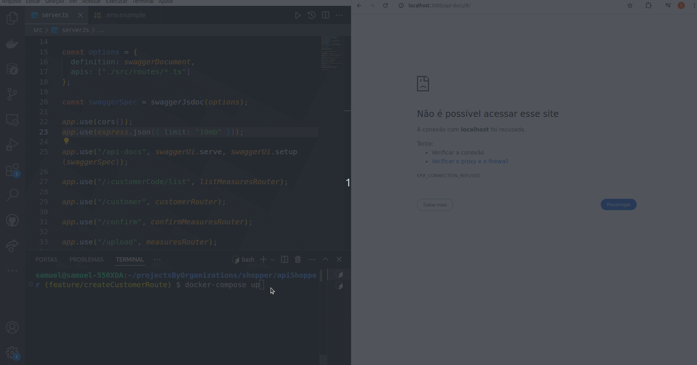

#  API de medición de cuentas de gas y agua 

## 🌠[](https://github.com/SamuelRocha91/apiMeasureWaterAndGas/blob/main/README.md) [](https://github.com/SamuelRocha91/apiMeasureWaterAndGas/blob/main/README_es.md) [](https://github.com/SamuelRocha91/apiMeasureWaterAndGas/blob/main/README_en.md) [](https://github.com/SamuelRocha91/apiMeasureWaterAndGas/blob/main/README_ru.md) [](https://github.com/SamuelRocha91/apiMeasureWaterAndGas/blob/main/README_ch.md) [](https://github.com/SamuelRocha91/apiMeasureWaterAndGas/blob/main/README_ar.md)

Se trata de una API desarrollada para gestionar las mediciones de clientes en diferentes tipos de servicios. La aplicación utiliza Node.js, TypeScript, Prisma, Express.js y otras tecnologías para ofrecer un backend robusto y escalable.


<details>
  <summary><h2>📏 FrontEnd</h2></summary>
  
  - 📏 [Aplicación de Precisión en React](https://github.com/SamuelRocha91/precisionReactApplication/blob/main/README_ens.md) - Interfaz para el registro de mediciones de gas y agua
  
  
  

</details>

<details>
  <summary><h2>🛠️ Tecnologías Utilizadas</h2></summary>

  - **Node.js**: Entorno de ejecución para JavaScript en el backend.
  - **TypeScript**: Superconjunto de JavaScript que añade tipado estático al código.
  - **Express.js**: Framework web minimalista para Node.js.
  - **Prisma**: ORM que facilita el acceso a la base de datos.
  - **MySQL**: Base de datos utilizada durante el desarrollo.
  - **ESLint**: Herramienta de linting para mantener el código limpio y estandarizado.
  - **Jest**: Framework de pruebas utilizado para garantizar la calidad del código.
  - **Mocha**: Utilizado para pruebas adicionales.
  - **Google Generative AI**: Integrado para analizar imágenes de medidores y extraer valores numéricos de las mediciones.
  - **Swagger**: Integrado para generar documentación para las rutas.

</details>

<details>
  <summary><h2>📁 Estructura del Proyecto</h2></summary>

  El proyecto sigue una estructura modular para facilitar el mantenimiento y la escalabilidad. Las principales carpetas y archivos son:

  - `src/`: Contiene el código fuente de la aplicación.
    - `controllers/`: Lógica de control, donde se procesan las solicitudes.
    - `db/`: Genera una instancia de prisma para la conexión con la base de datos para toda la aplicación.
    - `exceptions/`: Crea excepciones personalizadas para manejar errores durante la ejecución de la aplicación.
    - `interfaces/`: Crea interfaces y tipos para manejar parámetros y retornos de funciones.
    - `middlewares/`: Middlewares para validaciones y tratamientos.
    - `models/`: Lógica de conexión con la base de datos.
    - `services/`: Capa de servicios que interactúa con Prisma y realiza operaciones de negocio.
    - `routes/`: Definición de las rutas de la API.
    - `utils/`: Funciones utilitarias, como manipulación de imágenes e interacción con la API de Google Generative AI.
    - `tests/`: Pruebas automatizadas para validar las funcionalidades.

</details>

<details>
  <summary><h2>⚙️ Funcionalidades</h2></summary>

  - **Listar Mediciones**: Permite listar todas las mediciones de un cliente específico, filtrando por tipo de medición.
  - **Gestión de Imágenes**: Las imágenes de mediciones se guardan y recuperan a través de URLs temporales, utilizando Base64.
  - **Validación de Parámetros**: Middleware para validar parámetros de entrada, garantizando la integridad de las solicitudes.
  - **Análisis de Imágenes con Google Generative AI**: La API analiza imágenes de mediciones y extrae el valor de consumo mostrado.

</details>

<details>
  <summary><h2>🚀 Cómo Ejecutar el Proyecto</h2></summary>

  ### Requisitos

  - Node.js
  - Docker (opcional para el entorno de desarrollo)

  ### Instalación

  1. Clona el repositorio:
      ```bash
      git clone https://github.com/SamuelRocha91/apiShopper.git
      cd apiMeasureWaterAndGas
      ```

  2. Instala las dependencias:
      ```bash
      npm install
      ```

  3. Configura las variables de entorno:
      - Crea un archivo `.env` con las configuraciones necesarias.
      - Ejemplo:
        ```env
        DATABASE_URL="file:./dev.db"
        GEMINI_API_KEY="tu_clave_api_google"
        HOST="http://localhost:3000"
        ```

  4. Ejecuta las migraciones de la base de datos:
      ```bash
      npx prisma migrate dev
      ```

  5. Inicia el servidor:
      ```bash
      npm run dev
      ```

  ### Docker

  Puedes ejecutar el proyecto utilizando Docker. Para ello, ejecuta:

  ```bash
  docker-compose up --build
  ```

</details>

<details>
  <summary><h2>🧪 Pruebas</h2></summary>

  Las pruebas se ejecutan con Jest y Mocha. Para ejecutar todas las pruebas:

  ```bash
  npm run test
  ```

</details>

<details>
  <summary><h2>🤝 Contribución</h2></summary>

  Siéntete libre de abrir issues o enviar pull requests. ¡Toda contribución es bienvenida!

</details>

<details>
  <summary><h2>📜 Scripts Disponibles</h2></summary>

  - `start`: Inicia la aplicación.
  - `dev`: Inicia la aplicación en modo de desarrollo.
  - `build`: Compila el código TypeScript a JavaScript.
  - `lint`: Ejecuta ESLint para verificar la conformidad del código.
  - `lint:fix`: Ejecuta ESLint y corrige problemas automáticamente.
  - `prisma:generate`: Genera los tipos de Prisma.
  - `prisma:migrate`: Ejecuta migraciones de la base de datos.
  - `prisma:seed`: Población de la base de datos con datos iniciales.
  - `docker`: Instala las dependencias, genera los tipos de Prisma, ejecuta migraciones e inicia el servidor utilizando Nodemon.
  - `test`: Ejecuta todas las pruebas usando Mocha y Jest.

</details>

<details>
  <summary><h2>🖼️ Configuración de Imagen</h2></summary>

  Funciones utilitarias para guardar y generar URLs para imágenes:

  - **`saveBase64Image`**: Guarda una imagen Base64 en un archivo en el servidor.
  - **`getImageUrl`**: Genera una URL temporal para acceder a la imagen.
  - **`extractMimeType`**: Extrae el tipo MIME de una imagen Base64.
  - **`extractSize`**: Calcula el tamaño de una imagen Base64.

</details>

<details>
  <summary><h2>🔍 Análisis de Imágenes con Google Generative AI</h2></summary>

  La función **`checkMeasureValue`** utiliza Google Generative AI para analizar imágenes de mediciones y extraer el valor de consumo.

  ```javascript
  async function checkMeasureValue(mime: string, base64: string): Promise<number> {
    const result = await model.generateContent([
      {
        inlineData: {
          mimeType: mime,
          data: base64
        }
      },
      { text: PROMPT }
    ]);

    return Number(result.response.text().match(/\d+/)[0]);
  }
  ```

  Esta función se utiliza para garantizar que el valor de la medición sea extraído con precisión a partir de la imagen proporcionada.

</details>

<details>
  <summary><h2>🔗 Otros Repositorios:</h2></summary>

  - 💎 [BackEnd de Delivery](https://github.com/SamuelRocha91/delivery-backend/blob/main/README_es.md)
  - 💳 [API de Pagos](

https://github.com/SamuelRocha91/paymentAPI/blob/main/README_es.md)
  - 📦 [API de Vendedores](https://github.com/SamuelRocha91/sellerAPI/blob/main/README_es.md)
  - 🎫 [API de Compras](https://github.com/SamuelRocha91/consumerAPI/blob/main/README_es.md)

</details>